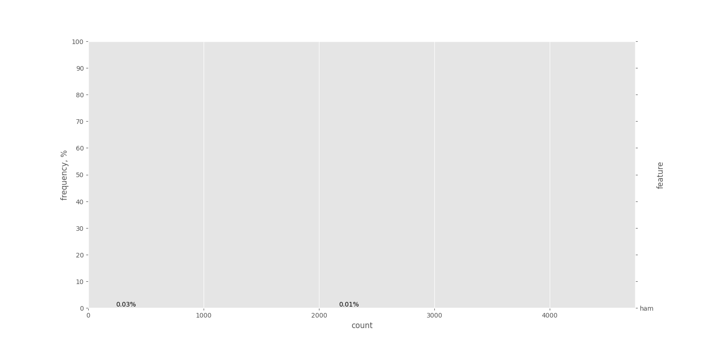
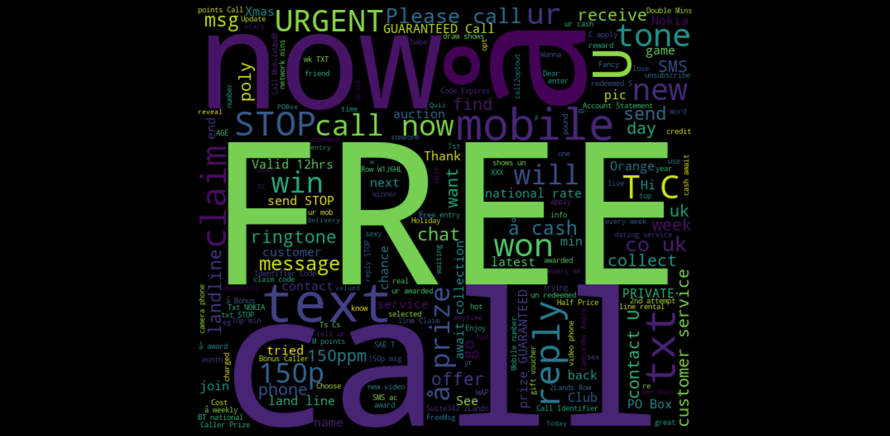
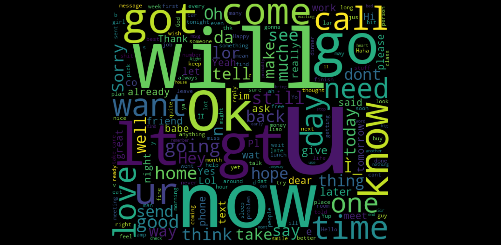
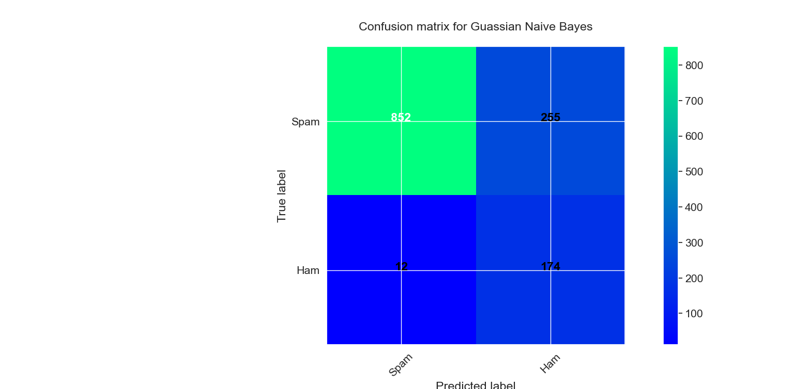
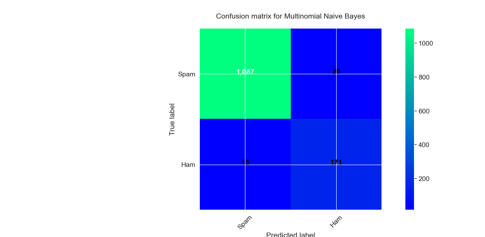
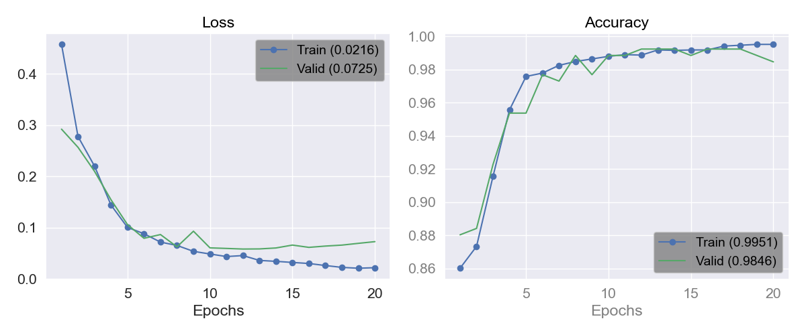
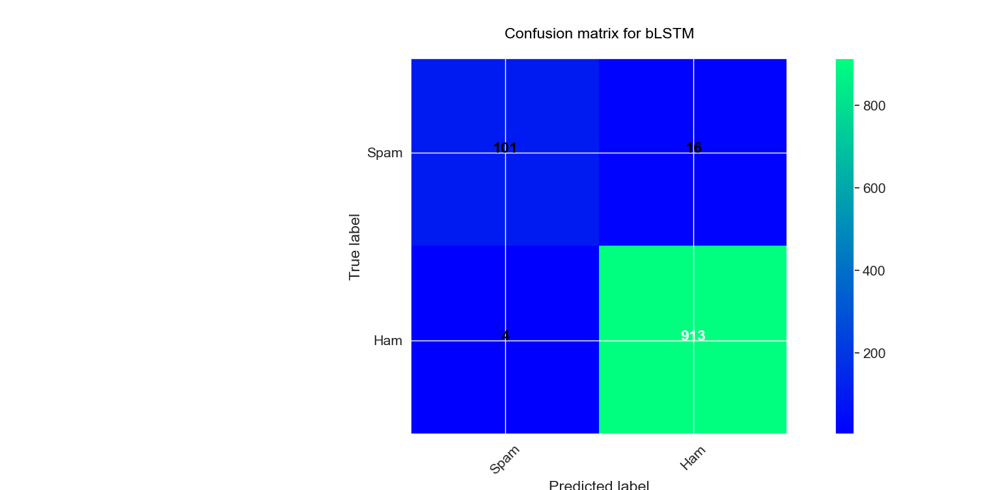

# SMS Spam Classification Using Machine Learning and Deep Learning

**Author:** Rutuja1423

---

## Problem Statement

SMS spam is a persistent problem that affects billions of mobile users worldwide. Manually filtering unwanted messages is impractical at scale. There is a need for an automated classification system that can accurately distinguish between legitimate messages (ham) and unsolicited spam based on the textual content of SMS messages. This project addresses this challenge using both classical Machine Learning and Deep Learning approaches.

---

## Objectives

- Load and explore the SMS spam dataset to understand class distribution and textual patterns.
- Perform text preprocessing including email/URL/phone normalization, stopword removal, and lemmatization.
- Visualize word frequency distributions and word clouds for spam and ham messages.
- Train and evaluate seven classical ML classifiers for spam detection.
- Build and train a Bidirectional LSTM deep learning model for sequence-based classification.
- Compare ML and DL approaches across accuracy, precision, recall, and F1-score.
- Save the trained model and demonstrate real-time prediction on custom messages.

---

## Dataset

- **Source:** SMS Spam Collection
- **Format:** CSV (Latin-1 encoded)
- **Location:** `Data/spam.csv`
- **Task:** Binary classification (Spam vs. Ham)

| Label | Description |
|---|---|
| **ham** | Legitimate personal message |
| **spam** | Unsolicited promotional/fraudulent message |

---

## Project Structure

```
SMS_Spam_Classification_ML_DL/
├── Data/
│   └── spam.csv                       # SMS spam dataset
├── Images/
│   ├── Figure_1.png                   # Class distribution
│   ├── Figure_2.png                   # Word frequency (raw)
│   ├── Figure_3.png                   # Word cloud - Spam
│   ├── Figure_4.png                   # Word cloud - Ham
│   ├── Figure_5.png                   # Word frequency (preprocessed)
│   ├── Figure_6.png                   # Gaussian NB confusion matrix
│   ├── Figure_7.png                   # Multinomial NB confusion matrix
│   ├── Figure_8.png                   # Decision Tree confusion matrix
│   ├── Figure_9.png                   # Logistic Regression confusion matrix
│   ├── Figure_10.png                  # KNN confusion matrix
│   ├── Figure_11.png                  # SVC confusion matrix
│   ├── Figure_12.png                  # Gradient Boosting confusion matrix
│   ├── Figure_13.png                  # Bagging confusion matrix
│   ├── Figure_14.png                  # LSTM training history
│   └── Figure_15.png                  # LSTM confusion matrix
├── spam_classification.py             # Python script (full pipeline)
├── spam_classification.ipynb          # Jupyter Notebook (with interpretations)
├── My_model.h5                        # Saved Keras model
├── My_model.pkl                       # Saved tokenizer
├── requirements.txt                   # Python dependencies
├── .gitignore                         # Git ignore rules
└── README.md                          # Project documentation
```

---

## Methodology

### Part 1: Machine Learning Approach

#### Text Preprocessing
- Email address, URL, and phone number normalization
- Currency symbol and number replacement with standardized tokens
- Stopword removal using NLTK
- Lemmatization using WordNet

#### Feature Extraction
- **CountVectorizer** with a vocabulary of 1,000 features (Bag-of-Words)

#### Models Trained

| Model | Accuracy | Error Rate | Key Observation |
|---|---|---|---|
| **Logistic Regression** | **~97.68%** | **~2.32%** | Highest accuracy; near-perfect ham protection |
| **SVC** | **~97.68%** | **~2.32%** | Tied for best; effective on sparse text data |
| Gradient Boosting | ~97.45% | ~2.55% | Excellent spam precision |
| Multinomial Naive Bayes | ~97.29% | ~2.71% | Best balance across both classes |
| Bagging Classifier | ~96.21% | ~3.79% | Stable but ~15% spam leakage |
| Decision Tree | ~95.82% | ~4.18% | Solid but outperformed by ensembles |
| K-Nearest Neighbors | ~94.43% | ~5.57% | Weak spam detection (~31% missed) |
| Gaussian Naive Bayes | ~79.43% | ~20.57% | Poor; violated distributional assumptions |

---

### Part 2: Deep Learning Approach

#### Architecture: Bidirectional LSTM

| Layer | Purpose |
|---|---|
| Embedding (64-dim) | Learns dense word representations |
| Bidirectional LSTM (100 units) | Captures sequential context in both directions |
| Dropout (30%) | Regularization to prevent overfitting |
| Dense (20 units, ReLU) | Higher-level feature learning |
| Dropout (30%) | Additional regularization |
| Dense (1 unit, Sigmoid) | Binary classification output |

#### Training Configuration
- Optimizer: Adam (learning rate = 0.0001)
- Loss: Binary crossentropy
- Epochs: 20
- Vocabulary size: 1,000

#### Results
- **Test accuracy: ~98.16%**
- Training-validation gap: ~1-1.5% (minimal overfitting)
- Model saved as `.h5` with tokenizer as `.pkl`

---

## Visualizations

### Class Distribution



### Word Clouds

| Spam Messages | Ham Messages |
|---|---|
|  |  |

### ML Model Confusion Matrices

| Gaussian NB | Multinomial NB |
|---|---|
|  |  |

| Logistic Regression | SVC |
|---|---|
|  |  |

### Deep Learning Training History



### LSTM Confusion Matrix



---

## Installation and Usage

### Prerequisites

- Python 3.8 or higher

### Setup

1. Clone the repository:
   ```bash
   git clone https://github.com/Rutuja1423/SMS_Spam_Classification_ML_DL.git
   cd SMS_Spam_Classification_ML_DL
   ```

2. Install dependencies:
   ```bash
   pip install -r requirements.txt
   ```

3. Run the analysis:

   **Option A:** Python script
   ```bash
   python spam_classification.py
   ```

   **Option B:** Jupyter Notebook
   ```bash
   jupyter notebook spam_classification.ipynb
   ```

---

## Technologies Used

| Technology | Purpose |
|---|---|
| Python | Core programming language |
| Pandas / NumPy | Data manipulation |
| Matplotlib / Seaborn | Visualization |
| NLTK | Text preprocessing (tokenization, stopwords, lemmatization) |
| WordCloud | Word cloud generation |
| Scikit-learn | ML classifiers and evaluation metrics |
| TensorFlow / Keras | Bidirectional LSTM deep learning model |

---

## Future Improvements

- Implement attention mechanisms for improved sequence understanding.
- Experiment with transformer-based models (BERT, DistilBERT) for classification.
- Apply class balancing techniques (SMOTE, class weights) for the minority spam class.
- Build a mobile or web application for real-time SMS spam detection.
- Deploy the model as a REST API using Flask or FastAPI.

---

## License

This project is intended for educational and research purposes.

---
